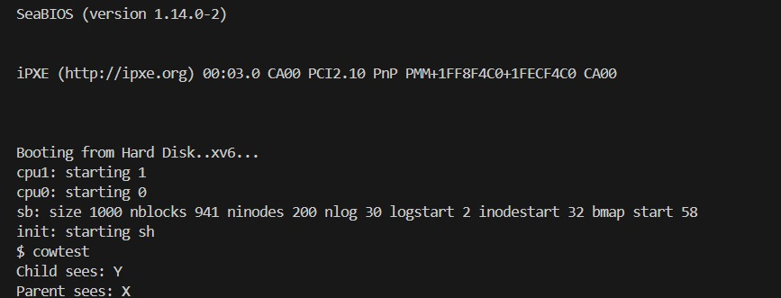
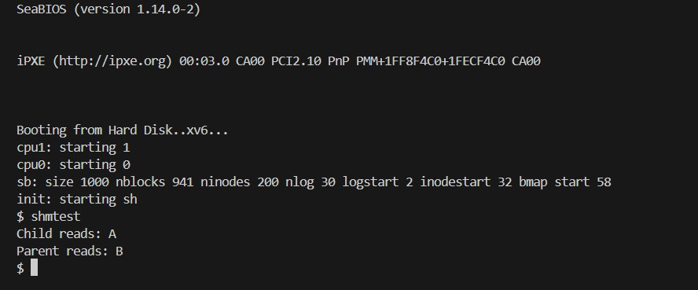

# 📝 Laporan Tugas Akhir Sistem Operasi

**Mata Kuliah**: Sistem Operasi  
**Semester**: Genap / Tahun Ajaran 2024–2025  
**Nama**: Agan Chois  
**NIM**: 240202893  
**Modul yang Dikerjakan**:  
Modul 3 – Manajemen Memori Lanjutan  
(A. Copy-on-Write Fork, B. Shared Memory ala System V)

---

## 📌 Deskripsi Singkat Tugas

Tugas ini merupakan bagian dari Modul 3, yang berfokus pada implementasi fitur manajemen memori tingkat lanjut pada sistem operasi xv6, meliputi:

- **A. Copy-on-Write (CoW) Fork**:  
  Fitur ini bertujuan untuk mengoptimalkan fungsi fork() dengan cara tidak langsung menggandakan seluruh memori proses anak, melainkan melakukan penyalinan halaman hanya ketika proses menulis ke halaman tersebut. Teknik ini menghemat penggunaan memori dan mempercepat proses fork.

- **B. Shared Memory ala System V**:  
  Fitur ini memungkinkan beberapa proses untuk berbagi area memori yang sama, mirip dengan antarmuka shmget dan shmrelease pada System V, sehingga proses dapat saling bertukar data tanpa perlu mekanisme IPC lain yang lebih kompleks.

---

## 🛠️ A. Implementasi Copy-on-Write Fork (CoW)

### ✏️ Perubahan yang Dilakukan

- Menambahkan bit flag PTE_COW di mmu.h:Flag ini digunakan untuk menandai entri page table sebagai halaman Copy-on-Write, sehingga saat terjadi penulisan, sistem tahu bahwa halaman perlu disalin terlebih dahulu.
- Membuat fungsi cowuvm() di vm.c untuk duplikasi page table CoW:Fungsi ini menggantikan copyuvm() pada fork, dengan cara menyalin struktur page table dari parent ke child tanpa mengalokasikan memori baru, melainkan berbagi halaman dan menandainya dengan PTE_COW.
- Menyesuaikan fork() di proc.c untuk menggunakan cowuvm:Implementasi fork diubah agar menggunakan mekanisme CoW saat membuat proses anak, sehingga efisiensi memori dapat dicapai sejak awal proses terbentuk.
- Menangani page fault T_PGFLT di trap.c dengan memeriksa PTE_COW:Ketika proses mencoba menulis ke halaman yang bertanda PTE_COW, handler page fault akan mendeteksi hal ini dan mengalokasikan halaman baru (copy fisik), lalu memperbarui page table untuk menghapus tanda CoW.
- Mengatur referensi dengan incref() dan decref() di kalloc.c:Untuk memastikan manajemen memori yang aman, referensi ke halaman fisik ditambah atau dikurangi sesuai kebutuhan. Ini mencegah halaman dibebaskan terlalu dini atau dibiarkan bocor.

### 🧪 Program Uji `cowtest.c`

```c
char *shm = (char*) shmget(42);
shm[0] = 'X';

if(fork() == 0){
  shm[0] = 'Y';
  printf(1, "Child sees: %c\n", shm[0]);
  exit();
} else {
  wait();
  printf(1, "Parent sees: %c\n", shm[0]);
}
```

### ✅ Output:
```
Child sees: Y
Parent sees: X
```
### 📸 Screenshot:


---

## 🛠️ B. Implementasi Shared Memory ala System V

### ✏️ Perubahan yang Dilakukan

- Menambahkan struktur `shmtab[]` di `vm.c`:
  ```c
  #define MAX_SHM 16
  struct {
    int key;
    char *frame;
    int refcount;
  } shmtab[MAX_SHM];
  ```

- Menambahkan dua system call:
  - `void* sys_shmget(int key)`
  - `int sys_shmrelease(int key)`

- Register syscall di:
  - `syscall.h`, `user.h`, `usys.S`, `syscall.c`

- Alamat shared memory dipetakan dari `USERTOP` ke bawah

### 🧪 Program Uji `shmtest.c`

```c
char *shm = (char*) shmget(42);
shm[0] = 'A';

if(fork() == 0){
  char *shm2 = (char*) shmget(42);
  printf(1, "Child reads: %c\n", shm2[0]);
  shm2[1] = 'B';
  shmrelease(42);
  exit();
} else {
  wait();
  printf(1, "Parent reads: %c\n", shm[1]);
  shmrelease(42);
}
```

### ✅ Output:
```
Child reads: A
Parent reads: B
```
### 📸 Screenshot:


---

## ⚠️ Kendala yang Dihadapi

- CoW:
  - Penanganan TLB flush (`lcr3`) setelah duplikasi halaman
  - Validasi halaman `PTE_P | PTE_COW` saat page fault

- Shared Memory:
  - Alokasi frame tunggal yang dipetakan ulang di dua proses
  - Sinkronisasi alokasi memori dan pembebasan (`refcount`)
  - Penempatan mapping di `USERTOP` – (i+1) * `PGSIZE` untuk menghindari konflik

---

## 📚 Referensi

- [xv6-public - MIT](https://github.com/mit-pdos/xv6-public)
- [Buku xv6 (MIT 6.828)](https://pdos.csail.mit.edu/6.828/2018/xv6/book-rev11.pdf)
- Diskusi praktikum,Stack Overflow & Github Issues.

---

