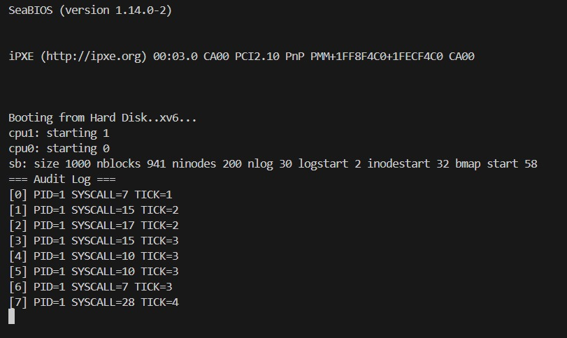

# 📝 Laporan Tugas Akhir

**Mata Kuliah**: Sistem Operasi  
**Semester**: Genap / Tahun Ajaran 2024–2025  
**Nama**: Agan Chois 
**NIM**: 240202893 
**Modul yang Dikerjakan**:  
Modul 5 – Audit dan Keamanan Sistem  

---

## 📌 Deskripsi Singkat Tugas

* **Modul 5 – Audit dan Keamanan Sistem**:  
  Modul ini berfokus pada peningkatan keamanan sistem xv6 melalui implementasi audit log yang mencatat semua aktivitas pemanggilan system call oleh setiap proses. Seluruh data log dicatat ke dalam buffer kernel dan hanya dapat diakses oleh proses init (PID 1) melalui system call khusus get_audit_log(). Fitur ini bertujuan untuk memonitor aktivitas sistem secara aman dan terkontrol.

---

## 🛠️ Rincian Implementasi

* Menambahkan struktur audit_entry dan array audit_log[] di syscall.c:Struktur ini menyimpan setiap entri log yang berisi informasi seperti nomor system call, PID pemanggil, dan waktu (tick). Array audit_log[] berfungsi sebagai buffer tetap di kernel untuk menyimpan kumpulan entri audit.
* Mencatat PID, syscall_num, dan tick pada setiap pemanggilan system call:Setiap kali system call dipanggil oleh proses, informasi terkait langsung dicatat ke buffer audit_log[]. Ini dilakukan di bagian awal dispatch system call di syscall.c.
* Menambahkan syscall baru get_audit_log() di sysproc.c, dan deklarasi di defs.h, user.h, usys.S, syscall.h:System call get_audit_log() dibuat untuk mengakses isi audit log. Namun, pemanggilannya dibatasi hanya untuk proses dengan PID 1 (yakni proses init). File header dan definisi syscall diperbarui agar syscall ini bisa diakses dari user space.
* Program uji audit.c untuk menampilkan isi log:Program ini akan memanggil syscall get_audit_log() dan menampilkan semua entri log system call yang telah terjadi. Digunakan sebagai alat verifikasi dan monitoring.
* Memodifikasi init.c agar langsung menjalankan audit (sebagai PID 1):Proses init secara otomatis menjalankan program audit saat boot. Hal ini memastikan bahwa hanya init yang memiliki akses legal terhadap audit log.
* Menambahkan audit ke Makefile dalam bagian UPROGS:File audit.c ditambahkan ke daftar program pengguna (UPROGS) agar otomatis dikompilasi dan tersedia di sistem xv6 saat dijalankan.

---

## ✅ Uji Fungsionalitas

* audit: program utama dijalankan oleh init, menampilkan semua system call yang telah terjadi.Program ini dijalankan oleh proses dengan PID 1 dan akan mencetak daftar lengkap system call dari semua proses ke layar sebagai bentuk audit sistem.
* Jika program audit dijalankan oleh proses selain PID 1, maka akan gagal (Access denied).Hal ini menunjukkan bahwa pembatasan akses audit telah diterapkan dengan benar, menjaga keamanan dan kerahasiaan data log di sistem.

---

## 📷 Hasil Uji

### 📍 Output `audit`:
```
=== Audit Log ===
[0] PID=1 SYSCALL=5 TICK=2
[1] PID=1 SYSCALL=6 TICK=2
[2] PID=1 SYSCALL=10 TICK=3
...
```

### 📸 Screenshot:


---

## ⚠️ Kendala yang Dihadapi

* Validasi PID di syscall `get_audit_log()` agar hanya proses `init` yang dapat mengakses log
* Penanganan pointer user-space menggunakan `argptr()` dan `memmove()`
* Menjaga proses `init` tetap hidup (menggunakan `sleep()` terus-menerus) agar kernel tidak panic

---

## 📚 Referensi

* Buku xv6 MIT: [https://pdos.csail.mit.edu/6.828/2018/xv6/book-rev11.pdf](https://pdos.csail.mit.edu/6.828/2018/xv6/book-rev11.pdf)  
* Repositori xv6-public: [https://github.com/mit-pdos/xv6-public](https://github.com/mit-pdos/xv6-public)  
* Diskusi praktikum, GitHub Issues, Stack Overflow

